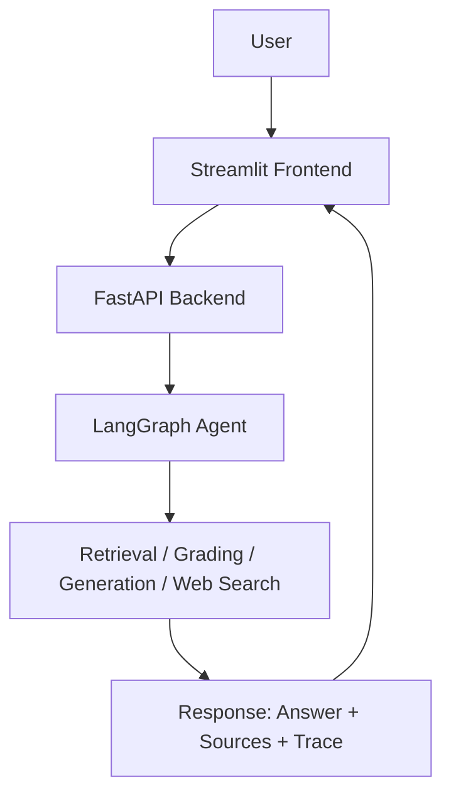
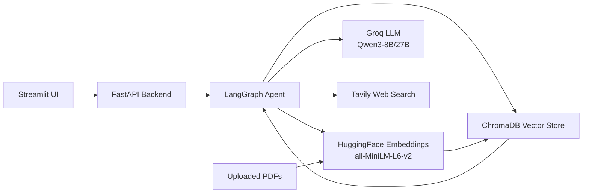
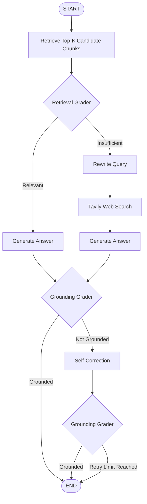
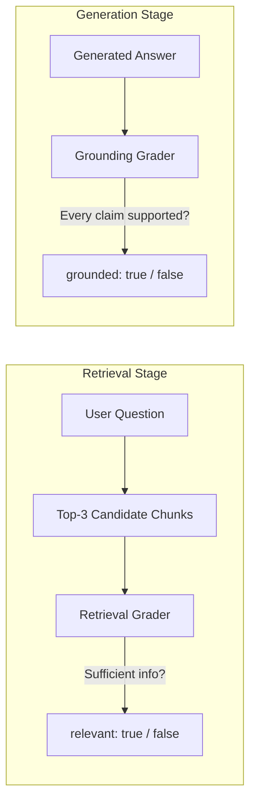
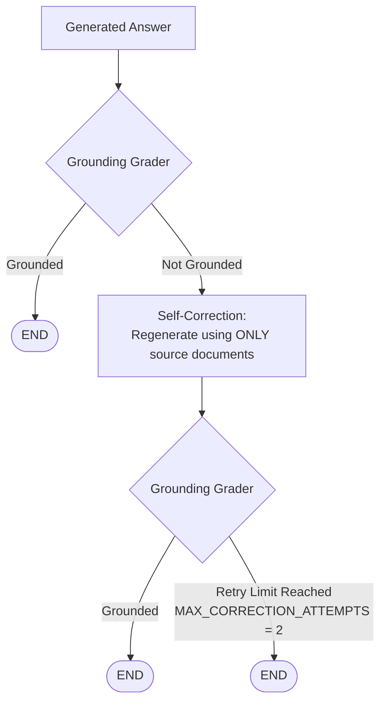
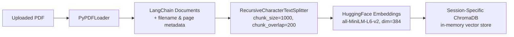
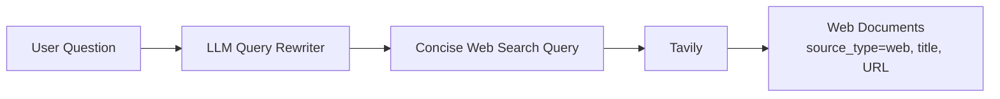

# 🔎 VeriRAG — Self-Evaluating Agentic RAG System

**Verified Retrieval-Augmented Generation with Automatic Grounding Correction**

VeriRAG retrieves information from uploaded PDFs or a persistent knowledge base, grades whether the retrieval is actually sufficient, falls back to live web search when it isn't, generates an answer, and then verifies that the answer is grounded in its sources — self-correcting when it isn't.


---

## Screenshots


## 📖 Overview

VeriRAG is a self-evaluating Agentic RAG system built with **LangGraph** as an explicit state machine. Unlike a standard RAG pipeline that retrieves and generates unconditionally, VeriRAG treats retrieval and generation as steps that must earn their way to the final answer:

- Retrieved chunks are graded for **relevance** before being used.
- If retrieval is insufficient, the system rewrites the query and falls back to **Tavily web search**.
- Every generated answer is graded for **grounding** — whether each factual claim is actually supported by the retrieved sources.
- If grounding fails, the system performs **self-correction** and re-verifies, up to a configured retry limit.

The result is a RAG pipeline that is explicit about *why* it trusts an answer, rather than assuming retrieval + generation is always correct.

---

## ❓ Problem Statement

Standard RAG pipelines have two silent failure modes:

1. **Bad retrieval, confident answer.** If the retriever returns irrelevant or insufficient chunks, the LLM will still generate a fluent, confident-sounding answer — often hallucinated.
2. **Ungrounded generation.** Even with relevant sources, an LLM can introduce claims that aren't actually supported by the retrieved text.

Most RAG demos generate once and stop. There is no verification step that checks whether the retrieval was adequate or whether the output is actually supported by evidence.

---

## ✅ Solution

VeriRAG addresses both failure modes with two independent, structured-output evaluators inserted directly into the agent graph:

| Check | Question it answers | Failure response |
|---|---|---|
| **Retrieval Grader** | Do the retrieved chunks contain enough information to answer this specific question? | Rewrite query → Tavily web search |
| **Grounding Grader** | Is every factual claim in the generated answer supported by the retrieved sources? | Self-correct → re-grade (max 2 attempts) |

These two checks are deliberately kept separate — relevance of retrieval and grounding of the final answer are different questions, and conflating them hides failure modes.

---

## ⭐ Key Features

- **Dual retrieval sources** — a permanent ChromaDB knowledge base and session-specific uploaded PDFs (in-memory vector store per session).
- **Retrieval relevance grading** — top-K candidate chunks are explicitly graded as sufficient or insufficient, not assumed correct.
- **Automatic web search fallback** — insufficient retrieval triggers query rewriting and a Tavily search, with results converted into LangChain `Document` objects.
- **Grounding verification** — a structured-output grader checks the generated answer against its sources before it is returned.
- **Self-correction loop** — ungrounded answers are regenerated using only the source documents, with a maximum of 2 correction attempts.
- **Execution trace** — the Streamlit UI shows a step-by-step agent workflow trace (retrieval → grading → generation → grounding) for full transparency.
- **Source attribution** — every answer includes PDF filename + page number, or web page title + URL.
- **REST API** — FastAPI backend with `/upload`, `/ask`, and `/health` endpoints, independent of the Streamlit frontend.

---

## 🏗️ Architecture

### 1. High-Level System Architecture



### 5. Data Flow / Component Architecture



---

## 🔄 Complete Agentic RAG Flow



**Routing logic:**

- If retrieval is graded **relevant** → answer is generated directly from the retrieved chunks.
- If retrieval is graded **insufficient** → the system does **not** generate from those chunks. It rewrites the query, performs a Tavily web search, and generates from the resulting web documents instead.
- In both cases, the generated answer passes through the **same** grounding verification stage.

---

## 🧪 Retrieval vs. Grounding Evaluation

These are two independent structured-output evaluators, applied at different stages of the pipeline:



| | Retrieval Grader | Grounding Grader |
|---|---|---|
| **Runs on** | Retrieved chunks, before generation | Generated answer, after generation |
| **Question** | Do these chunks contain enough info to answer the question? | Is every factual claim in the answer supported by the sources? |
| **Returns `false` when** | Documents are irrelevant, vaguely related, missing the specific fact, or insufficient | A claim is unsupported, contradicts sources, introduces outside knowledge, or can't be verified |
| **On failure** | Route to query rewriting + web search | Route to self-correction |

---

## 🔁 Self-Correction Loop



- `MAX_CORRECTION_ATTEMPTS = 2`
- Self-correction regenerates the answer using **only** the previously retrieved/searched source documents — it does not re-run retrieval or web search.
- The corrected answer is re-graded by the same Grounding Grader before being returned.

---

## 🧾 Execution Trace

The Streamlit interface renders a human-readable **agent execution trace** (also referred to as the system/agent workflow trace) showing each step the graph took. This is an execution trace of system/agent steps — **not** the LLM's internal chain-of-thought.

**Local PDF retrieval — success:**
```
✓ Retrieved 3 document chunks from uploaded PDF documents
✓ Retrieval Grader: Relevant
✓ Answer generated from retrieved sources
✓ Grounding Grader: Answer is grounded
```

**Web search fallback:**
```
✓ Retrieved 3 document chunks
✗ Retrieval Grader: Insufficient
✓ Query rewritten for web search
✓ Web search completed: 3 results found
✓ Answer generated from retrieved sources
✓ Grounding Grader: Answer is grounded
```

**Self-correction:**
```
✗ Grounding Grader: Answer is NOT fully grounded
↻ Self-correction attempt 1
✓ Corrected answer generated
✓ Grounding Grader: Answer is grounded
```

---

## 🛠️ Technology Stack

| Category | Technologies |
|---|---|
| **Language** | Python 3.11 |
| **LLM** | Groq (Qwen3-8B / Qwen3-27B) |
| **Orchestration** | LangChain, LangGraph |
| **Vector Store** | ChromaDB |
| **Embeddings** | HuggingFace `sentence-transformers/all-MiniLM-L6-v2` |
| **Document Processing** | `PyPDFLoader`, `RecursiveCharacterTextSplitter` |
| **Web Search** | Tavily |
| **Backend** | FastAPI, Pydantic |
| **Frontend** | Streamlit |
| **Tooling** | Git, GitHub, REST API, Conda/venv |

---

## 📁 Project Structure

```
VeriRAG/
├── app/
│   ├── config.py         # Configuration & parameters
│   ├── schemas.py        # Pydantic models / structured-output schemas
│   ├── retrieval.py       # Vector store & retriever logic
│   ├── graders.py         # Retrieval Grader & Grounding Grader
│   ├── tools.py            # Tavily web search integration
│   ├── agent.py           # LangGraph agent / graph definition
│   └── ingestion.py       # PDF loading, chunking, embedding
├── api.py                  # FastAPI application
├── streamlit_app.py        # Streamlit frontend
├── notebooks/
│   ├── 01_document_loading.ipynb
│   ├── chunking.ipynb
│   ├── 03_embedding.ipynb
│   ├── 04_retrieval.ipynb
│   ├── 05_basic_rag.ipynb
│   └── 06_retrieval_grader.ipynb
├── test_agent.py
├── test_tavily.py
├── test_llm.py
├── data/
│   └── documents/
├── chroma_db/
└── requirements.txt
```

The `notebooks/` directory represents the experimentation, learning, and prototyping phase of the project — each component (loading, chunking, embeddings, retrieval, basic RAG, grading) was first validated in isolation. The `app/` module is the production-oriented implementation that assembles these validated components into a single LangGraph agent.

---

## ⚙️ How It Works

### Document Ingestion Pipeline



1. PDFs are loaded with `PyPDFLoader`, producing per-page LangChain `Document` objects with filename and page metadata.
2. Documents are split with `RecursiveCharacterTextSplitter` (`chunk_size=1000`, `chunk_overlap=200`).
3. Chunks are embedded with `sentence-transformers/all-MiniLM-L6-v2` (384-dimensional embeddings).
4. An **in-memory, session-specific** Chroma vector store is created, keyed by session ID. Uploaded-document collections are not persisted across sessions.

### Retrieval Pipeline

- `RETRIEVAL_K = 3` — the retriever returns the **top 3 candidate chunks** by vector similarity.
- Returning 3 chunks does not imply all 3 are relevant — it is a candidate set.
- The **Retrieval Grader** evaluates whether these candidate chunks actually contain enough information to answer the question, using structured LLM output.

### Web Search Fallback



- Triggered only when the Retrieval Grader returns `relevant = False`.
- The query rewriting node **only** produces a better search query — it does not attempt to answer the question.
- Tavily results are converted into LangChain `Document` objects with `source_type = web`, `title`, and `URL` metadata, then passed into the same generation stage used for local retrieval.

### Grounding Verification

- The **Grounding Grader** is a structured-output evaluator that checks whether **every factual claim** in the generated answer is supported by the source documents used to generate it.
- Returns `grounded = False` if a claim is unsupported, contradicts the sources, introduces outside knowledge, or cannot be verified against the provided documents.
- On failure, the system enters the **self-correction** loop (see above), capped at `MAX_CORRECTION_ATTEMPTS = 2`.

---

## 🔌 API Endpoints

### `POST /upload`
Upload one or more PDF documents and create a session-specific vector store.

**Example request:**
```bash
curl -X POST "http://localhost:8000/upload" \
  -F "files=@dropout_paper.pdf"
```

**Example response:**
```json
{
  "session_id": "a1b2c3d4",
  "filenames": ["dropout_paper.pdf"],
  "status": "uploaded"
}
```

### `POST /ask`
Ask a question against either the permanent knowledge base or an uploaded session collection.

**Request body:**
```json
{
  "question": "What is dropout?",
  "session_id": "a1b2c3d4"
}
```

`session_id` is optional — when provided, the uploaded PDF collection for that session is used; when omitted, the permanent ChromaDB knowledge base is used.

**Example response:**
```json
{
  "answer": "Dropout is a technique that ...",
  "grounded": true,
  "sources": [
    {"type": "pdf", "filename": "dropout_paper.pdf", "page": 7}
  ],
  "trace": [
    "Retrieved 3 document chunks from uploaded PDF documents",
    "Retrieval Grader: Relevant",
    "Answer generated from retrieved sources",
    "Grounding Grader: Answer is grounded"
  ]
}
```

### `GET /health`
Returns service health status.

```json
{
  "status": "ok"
}
```

---

## 🖥️ Streamlit Interface

The Streamlit application (`streamlit_app.py`) provides:

- **PDF upload**, including multiple PDFs at once
- **Session-specific document retrieval** scoped to the uploaded collection
- A question input box for **question answering**
- A **Grounding Status** panel showing whether the answer is grounded
- A **Sources** section listing PDF filename/page or web title/URL
- An expandable **VeriRAG Reasoning Trace** panel showing the agent's execution trace
- Automatic **web fallback** when local retrieval is insufficient
- A **Clear Uploaded Documents** control to reset the session's document collection

**User experience:** a user uploads one or more PDFs, sees them listed under "Active Documents," and asks a question. VeriRAG retrieves candidate chunks, grades them, generates an answer (falling back to web search if needed), verifies grounding, and displays the answer alongside its sources and full execution trace — so the user can see exactly how the system arrived at its answer, not just the final text.

---

## 💬 Example Queries

### Example 1 — Local PDF Retrieval

**Question:** *"What is self-attention in the Transformer architecture?"*

```
Question → Retrieve top 3 candidate chunks → Retrieval Grader: Relevant
→ Generate → Grounding Grader: Grounded → Answer + PDF source
```

### Example 2 — Web Fallback

**Question:** *"What is the capital of Australia?"*

```
Question → Retrieve top 3 candidate chunks → Retrieval Grader: Insufficient
→ Rewrite query → Tavily → Generate → Grounding Grader → Answer + Web sources
```

This case demonstrates the fallback path: the local/uploaded PDF collection does not contain information about world capitals, so the Retrieval Grader correctly marks the retrieval as insufficient, and the system rewrites the query for a Tavily search before generating an answer from the web results.

### Example 3 — Self-Correction

As a controlled test, an intentionally incorrect or unsupported answer was fed into the Grounding Grader against a known source document. The grader correctly flagged the answer as not grounded, which triggered the self-correction node to regenerate the answer using only the source documents. The corrected answer was then re-evaluated by the Grounding Grader and passed, demonstrating the closed-loop self-evaluation and correction behavior of the system.

---

## 📦 Installation

**Requirements:** Python 3.11

```bash
# Create and activate environment
conda create -p ./venv python=3.11 -y
conda activate ./venv

# Install dependencies
pip install -r requirements.txt
```

### Environment Variables

Create a `.env` file in the project root:

```env
GROQ_API_KEY=your_groq_api_key
TAVILY_API_KEY=your_tavily_api_key
```

> Do not commit real API keys. Use `.env` and add it to `.gitignore`.

---

## ▶️ Running the Project

**Run the FastAPI backend:**
```bash
uvicorn api:app --reload
```

**Run the Streamlit frontend:**
```bash
streamlit run streamlit_app.py
```

---

## 🧪 Testing

```
test_agent.py     # Tests for the LangGraph agent and routing logic
test_tavily.py    # Tests for Tavily web search integration
test_llm.py       # Tests for LLM (Groq) connectivity and structured output
```

Run tests with:
```bash
pytest test_agent.py test_tavily.py test_llm.py
```

---

## 🚧 Future Improvements

- Persistent storage for uploaded-session vector collections (currently in-memory)
- Multi-turn conversational context across questions
- Configurable retrieval `K` and correction-attempt limits via the API
- Support for additional document formats beyond PDF
- Expanded automated test coverage for the grading nodes

---

## 📓 Learning / Research Notebooks

The `notebooks/` directory documents the experimentation phase that preceded the production `app/` implementation:

| Notebook | Purpose |
|---|---|
| `01_document_loading.ipynb` | PDF loading and metadata extraction experiments |
| `chunking.ipynb` | Chunk size / overlap experimentation |
| `03_embedding.ipynb` | Embedding model evaluation |
| `04_retrieval.ipynb` | Retriever and similarity search prototyping |
| `05_basic_rag.ipynb` | Baseline (non-agentic) RAG pipeline |
| `06_retrieval_grader.ipynb` | Prototyping the structured-output Retrieval Grader |

These notebooks are not part of the production runtime — they represent the iterative process that informed the design of `app/`.

---

## 👤 Author

**Prithviraj Mukhiya**
Final-Year ECE Student, Indian Institute of Information Technology (IIIT) Kota, Rajasthan

**Interests:** Data Science · Machine Learning · Deep Learning · Generative AI · Agentic AI · Retrieval-Augmented Generation (RAG) · Natural Language Processing · Computer Vision · Software Development

---

## 📫 Contact / GitHub

GitHub: [https://github.com/gojo2005](https://github.com/gojo2005)

Feel free to open an issue or reach out via GitHub for questions, feedback, or collaboration.
